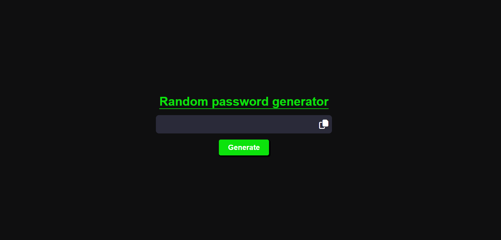
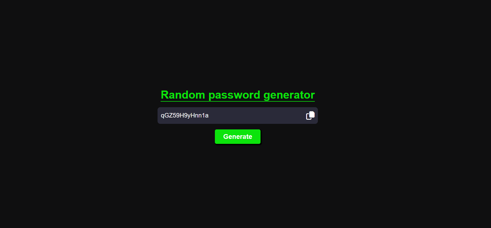

# Simple Random Password Generator

A simple web-based application for generating random passwords. This project uses HTML, CSS, and JavaScript to create a user-friendly interface for generating strong and secure passwords.

 
 

## Table of Contents

- [Features](#features)
- [Usage](#usage)
- [How it Works](#how-it-works)
- [Stay-in-Touch](#Stay-in-Touch)

## Features

- Generate random passwords in just one click.
- includes uppercase letters, lowercase letters, numbers, and special characters.
- Copy generated passwords to the clipboard with a single click.
- User-friendly and responsive interface design.

## Usage

1. Visit the [live demo link](https://random-password-generator-net.netlify.app/)
2. Click the "Generate" button to generate a random password.
3. Click the "Copy" icon to copy the generated password to your clipboard.

## Stay-in-Touch

Connect with me on social media:

