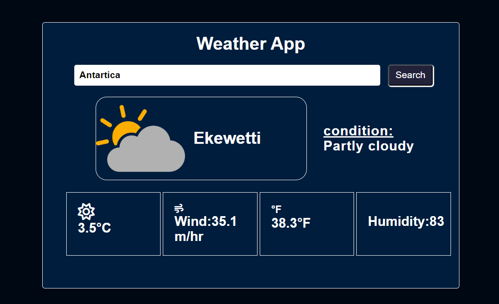

# Weather App

A simple web application that provides users with real-time weather information for a specified location. This app is built using HTML, CSS, and JavaScript for the frontend and integrates a third-party weather API to retrieve accurate weather data.

## Table of Contents

- [Description](#description)
- [Features](#features)
- [Demo](#demo)
- [Stay-in-Touch](#Stay-in-Touch)

## Description

The Weather App allows users to access current weather conditions by searching for a specific location. It combines an intuitive user interface with accurate weather data fetched from a reliable API.

## Features

- **Location-Based Search:** Users can search for weather information by entering a location, such as a city or country.

- **Current Weather:** The app displays the current weather conditions, including temperature, weather description, humidity, and wind speed.

- **Weather Icons:** Weather icons are used to visually represent different weather conditions, enhancing the user experience.

- **Responsive Design:** The app is designed to be responsive, providing an optimal viewing experience on both mobile and desktop devices.

## Demo

Check out the live demo of the Weather App [here](https://weather-app-netlifyy.netlify.app/).

Feel free to explore the app and see how it provides up-to-date weather information for various locations. This project demonstrates the use of web technologies to create a practical and user-friendly weather application.

## Stay-in-Touch

Connect with me on social media:

